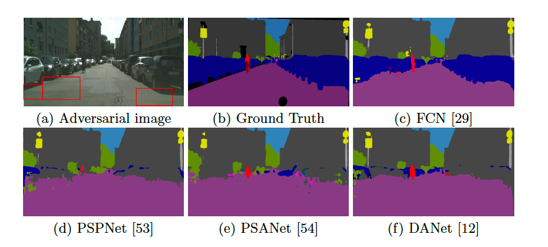

# Indirect Local Attacks for Context-aware Semantic Segmentation Networks

### Introduction

This repository is a PyTorch implementation of indirect local attacks for semantic segmentation / scene parsing. The code is easy to use for attacking various datasets. The codebase mainly uses ResNet50 as backbone and can be easily adapted to other basic classification structures. 

